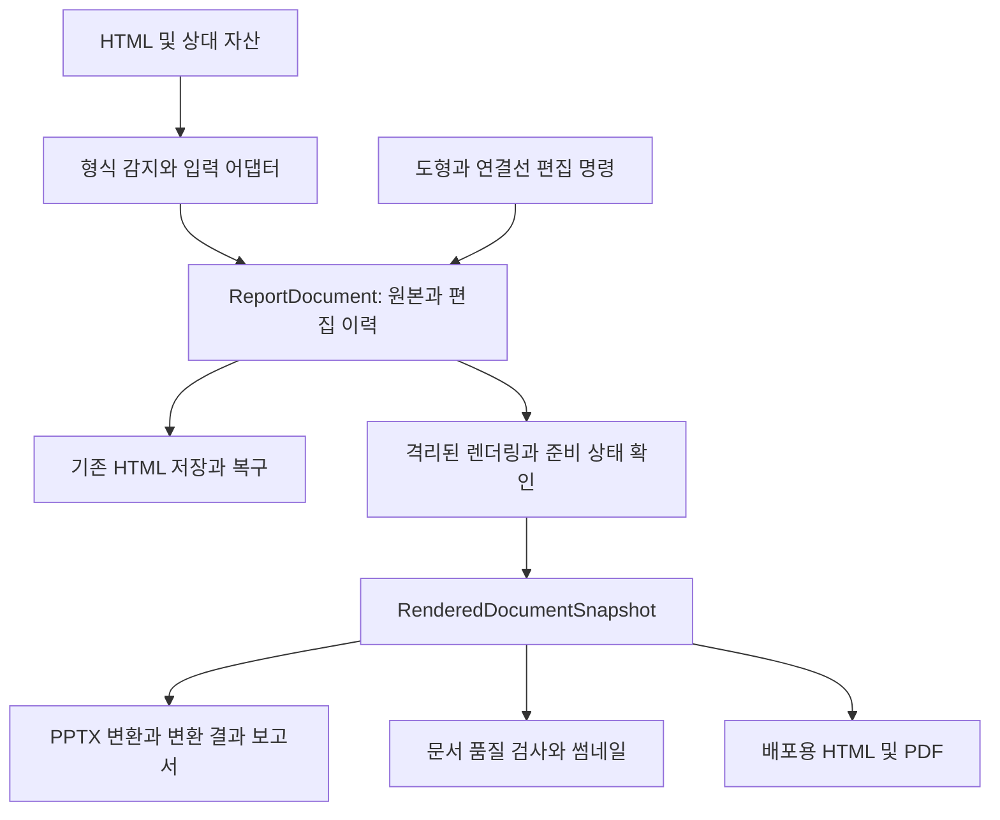

# HTMLpoint 비교 분석 및 개선 계획

작성일: 2026-09-18 · 상태: 제안 · 제품 구현 변경 없음

## 1. 결론과 제품 방향

HTMLpoint의 가장 큰 공백은 **다양한 HTML을 편집 대상으로 받아들이는 능력, 도식의 의미를 유지하는 개체 편집, 편집 가능한 PPTX 출력**이다. 기존 보고서의 표·이미지·일부 SVG 데이터 편집과 저장·복구 기반은 이미 갖추고 있다. 따라서 권장 방향은 **“기존 HTML 보고서를 보존하면서 도식을 보완하고, HTML과 PowerPoint로 전달하는 오프라인 편집기”**다.

구현 순서는 **입력 어댑터 → 렌더링 결과 모델 → PPTX 출력 → 도식 작성 → 부분 텍스트 서식·문서 품질 검사**를 권장한다. 입력과 렌더링 기반은 이후 기능이 공유한다. 기존 보고서로 PPTX 시제품을 만드는 기술 검증은 입력 확장과 독립적으로 시작할 수 있다.

신규 기능 개발과 별개로 이전 세션에서 남은 네이티브 Open/Save As·Microsoft IME·기본 패키징 검증을 첫 출시 조건으로 유지한다. 자동 검사 통과와 실제 Windows 사용 검증은 구분한다.

## 2. 조사 범위와 증거 수준

| 대상 | 확인한 기준 | 조사 방식 |
| --- | --- | --- |
| HTMLpoint | `25d349172eaf5d6c5efe5e76e93942c75df5a6de`, package 0.3.0 | 제품 사양, UI, parser/serializer, 편집·배치·히스토리, Electron 저장, 테스트·배포 설정 검토 |
| html-diagram | `ad28607300e19a76dacd7b9b5957a6b0e6cf0a9c` | README, 편집 엔진, 품질 검사, 정적 출력, 예제·회귀 검사 코드 검토 |
| html-to-ppt-elements | `54fdb220e310cf91064a57c0cefd98a5f0474586` | README, types/extractor/renderer/index, 테스트, package 검토 |

외부 두 저장소는 임시 폴더에 내려받아 소스를 읽었다. 설치 스크립트·변환 CLI·외부 HTML의 스크립트는 실행하지 않았다. 외부 앱의 실제 편집 체감, PowerPoint 렌더링 품질, 성능의 우열은 이번에 측정하지 않았다.

이번에 직접 실행한 검사는 **HTMLpoint의 실제 `parseReportHtml` 함수에 외부 HTML을 입력하는 호환성 검사**다. Vite SSR로 현재 소스를 로드하고 jsdom의 DOM API를 제공했다. 화면 렌더링·외부 스크립트 실행은 없는 파서 검사다. 최초 실행의 NodeFilter 전역 누락은 조사용 환경 문제였으며 전역을 추가한 뒤 완료했다. 결과는 [파서 검사 기록](research/2026-09-18-reference-import-probe.json)에 남겼다.

이 문서의 표현 기준:

- **확인**: 직접 읽은 구현 또는 이번 실행 결과.
- **위험/추론**: 소스 구조상 발생할 수 있으나 화면에서 재현하지 않은 사항.
- **제안/완료 기준**: 향후 구현·검증할 범위. 현재 지원 기능을 뜻하지 않는다.

## 3. 참고 프로젝트에서 가져올 개념

### html-diagram: 관계를 유지하는 도식 편집

고정 크기 캔버스 안의 노드와 노드 ID를 참조하는 연결선을 구분한다. 이동 시 연결선이 따라가고, 끝점·곡률·라벨을 편집하며, 개체 복제·문서 간 복사와 부분 텍스트 서식을 제공한다. 배울 점은 **좌표뿐 아니라 개체 사이 관계를 저장하는 모델**이다. [README](https://github.com/tonywjs/html-diagram/blob/ad28607300e19a76dacd7b9b5957a6b0e6cf0a9c/README.md), [편집 엔진](https://github.com/tonywjs/html-diagram/blob/ad28607300e19a76dacd7b9b5957a6b0e6cf0a9c/assets/fig-editor.js)

편집 가능한 HTML과 편집기를 제거한 배포본을 구분한다. 배포본은 연결선을 SVG로 고정하며 화면 맞춤용 스크립트가 남으므로, “정적 배포”가 모든 JavaScript 제거를 뜻하지는 않는다. HTMLpoint에도 원본 저장과 배포용 출력을 구분하는 제품 흐름이 유용하다. [정적 출력 구현](https://github.com/tonywjs/html-diagram/blob/ad28607300e19a76dacd7b9b5957a6b0e6cf0a9c/assets/fig-editor.js#L1447)

문자 크기와 격자 점유율을 자동 검사한다. 이 접근은 참고하되 12px·75%라는 기준을 보고서 전체에 그대로 적용하지 않는다. 큰 배경판도 점유율을 올릴 수 있으므로 해당 지표를 가독성이나 배치 완성도의 보증으로 사용하지 않는다. [품질 검사 구현](https://github.com/tonywjs/html-diagram/blob/ad28607300e19a76dacd7b9b5957a6b0e6cf0a9c/assets/quality-check.js)

### html-to-ppt-elements: 렌더링과 출력 형식의 분리

브라우저에서 크기·위치·computed style을 읽어 중간 `SlideModel`을 만들고, 별도 렌더러가 PPTX 객체로 변환한다. HTMLpoint에 유용한 것은 **DOM 편집 모델과 출력용 렌더링 모델을 분리하는 구조**다. [구조 설명](https://github.com/CYJ1226/html-to-ppt-elements/blob/54fdb220e310cf91064a57c0cefd98a5f0474586/README.md), [중간 모델](https://github.com/CYJ1226/html-to-ppt-elements/blob/54fdb220e310cf91064a57c0cefd98a5f0474586/src/types.ts)

그대로 제품 엔진으로 채택하기에는 다음 제한이 확인된다.

| 확인 사항 | HTMLpoint 설계에 반영할 점 |
| --- | --- |
| `.slide-portrait`의 첫 요소 또는 body를 추출 대상으로 사용 | 복수 섹션·언어·긴 보고서의 페이지 분할을 별도로 설계 |
| SVG는 PNG 캡처로 변환 | 벡터 그림 보존과 개별 도형 편집 가능 여부를 분리해서 표시 |
| 텍스트 부모의 전체 문구와 자식 요소를 각각 추출하는 경로 존재 | 중첩 텍스트 중복 위험을 fixture로 검증하고 text-run 소유권을 정의 |
| A4 세로 고정, X/Y 좌표를 각각 배율 변환 | 슬라이드 비율 선택 및 종횡비 보존 적용 |
| 글자 크기는 좌표 배율과 별개로 px×72/96 사용 | 글자·선·도형에 같은 출력 배율을 적용하는 단위 규칙 정의 |
| 요소 렌더링 예외를 로그에 남기고 파일 생성 계속 | 누락·대체·실패 항목이 포함된 변환 결과 보고서 제공 |

위 내용은 [추출기](https://github.com/CYJ1226/html-to-ppt-elements/blob/54fdb220e310cf91064a57c0cefd98a5f0474586/src/extractor.ts)와 [PPT 렌더러](https://github.com/CYJ1226/html-to-ppt-elements/blob/54fdb220e310cf91064a57c0cefd98a5f0474586/src/renderer.ts)를 읽은 결과다. 중첩 텍스트 중복과 출력 왜곡은 소스상 위험이며 이번에 PPTX로 재현한 결함은 아니다.

등록된 테스트는 색상 변환·파일 정렬에 관한 5개다. 변환 결과를 PowerPoint에서 열어 외관·객체 편집을 검사하는 테스트는 확인하지 못했다. 따라서 범용 변환 품질이 입증된 엔진으로 취급하지 않는다. [테스트 코드](https://github.com/CYJ1226/html-to-ppt-elements/blob/54fdb220e310cf91064a57c0cefd98a5f0474586/test/pipeline.test.ts)

## 4. HTMLpoint의 강점과 부족한 점

### 이미 있는 기능

- 원본 HTML 구조를 기반으로 편집하고 상대 자산을 포함해 Save As한다. 백업·자동 복구·보존 개수 제한이 구현되어 있다.
- 다중 선택, 드래그·크기 조절, 정렬·균등 배분, 스냅, 키보드 이동과 Undo/Redo가 있다.
- 표 편집, 이미지 교체·크롭·화살표·모자이크, 일부 SVG 차트 데이터 편집, 언어 전환, 동적 표 캡처가 있다.
- Windows 설치판·포터블 패키징 및 Electron 파일 I/O 회귀 검사가 있다.

근거: [제품 사양](product-spec.md), [편집 명령](../src/lib/editing.ts), [배치 선택](../src/lib/objectLayout.ts), [파일 지속성](../electron/filePersistence.ts), [검증 기록](../QA_IMPROVEMENTS_2026-09-12.md). 위 기능을 새로 만드는 작업으로 다시 계획하지 않는다.

### 격차 목록

우선순위는 이번 제품 확장의 순서다. P0가 모두 기존 제품의 긴급 결함이라는 뜻은 아니다.

| ID | 우선순위 | 부족한 점과 사용자 영향 | 코드 근거 / 판정 |
| --- | --- | --- | --- |
| GAP-01 | P0 | `div` 기반 슬라이드·도식을 열지 못해 AI 생성 HTML을 다시 가공해야 함 | `htmlParser.ts`의 `header, section` 선택자와 `documentActions.ts`의 0개 섹션 거부. 파서 검사로 재현 |
| GAP-02 | P1 | HTML 저장만 제공하여 PowerPoint에서 후속 편집하려면 재작성 필요 | `Ribbon.tsx` Export는 Save As HTML. PPTX/PDF 생성 경로 없음 |
| GAP-03 | P1 | 텍스트 상자·도형·연결선으로 새 설명 도식을 만들 수 없음 | Insert는 표·이미지. 노드 타입에 shape/connector 없음. 이미지 화살표는 노드 간 연결선과 별개 |
| GAP-04 | P1 | 개체 복사·붙여넣기·복제·그룹·앞뒤 순서 등 반복 편집 흐름 부족 | 섹션 복제와 다중 정렬은 있으나 일반 개체 clipboard/group/layer 명령은 없음 |
| GAP-05 | P1 | 문장 일부만 강조하거나 링크·목록 서식을 직접 조정하기 어려움 | 인라인은 `plaintext-only`, 서식은 선택 노드 단위. 기존 자식 마크업 보존과 부분 서식 작성은 다른 기능 |
| GAP-06 | P0 기반 | 출력과 도식 관계가 공유할 안정적인 개체 식별·렌더링 결과 모델 부족 | `makeNodeId`는 섹션·DOM 경로 기반. 기존 metric은 배치 편집용이며 text run·paint order·출력 대응 관계는 없음 |
| GAP-07 | P1 | 작은 글자·잘림·자산 누락·출력 대체 항목을 문서 단위로 찾기 어려움 | 저장 경고·변경 요약은 있지만 문서 품질 패널은 없음. 기능 회귀 검사는 문서 품질 검사와 별개 |
| GAP-08 | P2 | 수신자용 배포본과 편집 원본을 분리하고 실제 외관의 썸네일을 제공하는 흐름 부족 | serializer는 편집 흔적을 정리하지만 원본 script를 보존. 썸네일은 축약 CSS·이미지 자리표시자 사용 |
| GAP-09 | 출시 조건 | 실제 Windows 입력·기본 패키징에 미검증 범위가 남음 | 기존 QA 문서의 OS 파일창·IME·winCodeSign 제한. 이번 작업에서 재검증하지 않음 |

관련 소스: [types](../src/types/htmlpoint.ts), [parser](../src/lib/htmlParser.ts), [import validation](../src/lib/documentActions.ts), [Ribbon](../src/components/Ribbon.tsx), [DOM identity](../src/lib/domPaths.ts), [preview](../src/lib/preview.ts), [serializer](../src/lib/htmlSerializer.ts).

### 가장 먼저 재현된 문제: 입력 호환성

| 입력 | 도식 캔버스 | 도식 노드 / 연결선 | HTMLpoint 인식 섹션 |
| --- | ---: | ---: | ---: |
| html-diagram `demo.html` | 1 | 11 / 4 | 0 |
| `poster.html` | 2 | 54 / 20 | 0 |
| `drug-pipeline.html` | 1 | 11 / 7 | 0 |
| `poster-static.html` | 2 | 54 / 20 | 0 |
| 합성 `.slide-portrait` 문서 | 해당 없음 | 해당 없음 | 0 |
| 대조군: `<section><h1>…</h1>
…
</section>` | 해당 없음 | 해당 없음 | 1, 편집 노드 2개 |

HTMLpoint의 지원 형식 제한이 직접 확인됐다. 섹션이 0이면 가져오기 검증에서 거부되므로 우선 해결할 사용자 진입 문제다. 다만 모든 외부 HTML이 실패한다는 뜻은 아니며 위 입력에 한정된 결과다.

## 5. 권장 구조

원본 보존용 `ReportDocument`를 계속 편집의 기준으로 사용한다. 그 옆에 **읽기 전용 출력 스냅샷**을 추가한다. 모든 HTML을 절대 좌표 도식으로 바꾸거나 출력 JSON을 역으로 원본 DOM에 덮어쓰지 않는다.

### 5.1 입력 어댑터와 개체 식별

- 기존 보고서용 어댑터를 기본으로 유지하고 `fig-canvas`, 명시적 slide 클래스/속성용 어댑터를 추가한다. 중첩 컨테이너의 우선순위를 정해 같은 요소를 두 페이지로 중복 인식하지 않는다.
- 알 수 없는 구조는 후보 영역을 보여 주고 사용자가 편집 범위를 선택하게 한다. body 전체를 자동으로 분해해 구조 보존을 보장한다고 표시하지 않는다.
- parser만 바꾸지 않는다. serializer의 섹션 그룹화, preview 대상, 탐색, 변경 요약, Undo/Redo까지 같은 컨테이너 식별 규칙을 사용해야 한다.
- 내부 개체 ID와 원본의 HTML id/DOM path를 분리한다. 기존 작성자 id는 보존하고, 편집기 메타데이터의 버전을 정의한다. 새 ID의 저장·재열기·복제 시 재발급 규칙을 도식 기능 전에 정한다.
- `.fig-node`는 하나의 시각적 개체로 묶고 `.fig-edge`의 노드 참조를 읽는다. 정적 배포본의 구워진 SVG와 edge 선언을 동시에 그리지 않도록 구분한다.
- 외부 HTML 안의 편집 엔진과 HTMLpoint의 입력 처리가 충돌할 수 있다. 어댑터는 인식한 엔진만 preview에서 비활성화하고 표시를 재구성하는 방식을 검증한다. 기존 보고서의 동적 script를 일괄 제거하지 않는다. 원본 파일은 가져오기만으로 변경하지 않는다.

### 5.2 렌더링 결과 모델

제안 필드: `schemaVersion`, `reportRevision`, 페이지 크기·언어·분할 정보, `sourceRef`, `bounds`, `transform`, `paintOrder`, `textRuns`, 표 병합·행열 크기, 이미지 자산, 도형·연결선, `capabilities`, `warnings`.

- 줌·스크롤·DPI 영향을 제거한 문서 좌표로 추출한다. 단순 `z-index` 정렬 대신 중첩 stacking context를 반영하거나 표현 불가능한 subtree를 대체 처리한다.
- 폰트 준비, 이미지 decode, 동적 콘텐츠 준비를 확인하고 제한 시간을 둔다. `networkidle`만으로 준비 완료를 판단하지 않는다.
- 원본 개체와 출력 개체의 대응을 기록한다. 내용의 중복 추출과 누락을 이 대응 관계로 검사한다.
- snapshot은 해당 문서 revision에만 유효하다. 추출 도중 편집되면 고정된 revision으로 끝내거나 다시 추출하며, 서로 다른 revision을 섞지 않는다.
- Electron의 기존 Chromium을 재사용하는 격리된 출력 렌더링을 우선 검증한다. 제품에 별도 Playwright 브라우저를 추가할지는 성능·패키지 크기 측정 후 결정한다.
- 원본 HTML의 script가 출력 워커의 파일 접근 API를 얻지 않도록 기존 preview 격리와 자산 허용 범위를 유지한다. 임시 출력은 작업별 폴더에 기록한다.

### 5.3 PPTX 출력 범위

| 콘텐츠 | 첫 지원 목표 | 대체·제한 정책 |
| --- | --- | --- |
| 일반 텍스트·부분 서식 | 편집 가능한 text run | 폰트 대체·줄바꿈 차이 경고 |
| 사각형·둥근 사각형·타원 | 네이티브 shape | 복잡한 filter/clip/transform은 해당 개체만 그림으로 대체 |
| 표 | 네이티브 table, 지원 병합 구조 보존 | 미지원 병합은 명시적으로 알리고 그림 대체 또는 출력 중단 선택 |
| PNG/JPEG 등 | picture 객체 | 원본 해상도·비율 보존 |
| SVG | 가능한 경우 SVG picture | SVG 그림은 벡터 보존이지 내부 도형의 개별 편집 보장이 아님 |
| 연결선 | 직선부터 네이티브 선·연결 지원 검증 | 실제 PPT 개체 연결 관계 지원 여부를 기술 검증; 미지원 시 위치 고정 선으로 표시 |
| 차트·canvas | 초기에는 그림으로 보존 | 데이터가 명시적으로 있는 차트만 후속 native chart 후보 |

PptxGenJS는 후보 라이브러리다. SVG 지원과 Office 버전 조건은 [공식 이미지 문서](https://gitbrent.github.io/PptxGenJS/docs/api-images/)를 기준으로 검증한다. 모든 SVG를 editable shape로 바꿀 수 있다고 약속하지 않는다.

출력 설정은 **편집 우선 / 외관 우선**으로 제공한다. 편집 우선은 지원 콘텐츠를 객체로 변환하고 나머지만 그림으로 대체한다. 외관 우선의 페이지 그림 출력은 편집 가능한 PPTX와 명확히 구분한다.

문서 크기는 16:9·4:3·A4·원본 비율 중 하나로 선택한다. PowerPoint 한 파일의 페이지 크기를 통일하고, 서로 다른 원본 비율은 여백 또는 사용자가 정한 분할 규칙으로 처리한다. 긴 Section을 작은 한 장에 무조건 축소하지 않는다. 출력 전 분할 미리보기에서 표·문단의 경계를 확인한다.

출력 배율 `s`를 inch/원본 px로 정의하면 위치·크기는 `px × s`, 글자·선 두께는 `px × s × 72`로 일관되게 변환한다. 종횡비 보존 시 X/Y에 같은 배율을 사용한다. 실제 텍스트 줄바꿈은 Office 렌더러로 별도 검증한다.

### 5.4 도식과 텍스트 편집

- 자유 배치 도식은 명시적으로 만든 도식 영역에 우선 제공한다. 기존 grid/flex 본문을 임의로 absolute 배치로 바꾸지 않는다.
- 첫 범위는 텍스트 상자, 사각형·타원, 직선/직각 연결선, 라벨, 개체 복제·삭제, 앞뒤 순서다. 곡선 편집·복잡한 자동 경로 탐색·애니메이션은 후속으로 둔다.
- 연결선은 `from/to objectId + anchor`를 저장한다. 노드 이동·크기 조절·삭제·복제·Undo/Redo에서 관계가 유지되어야 한다.
- 그룹·문서 간 clipboard에는 선택된 노드의 내부 참조 재매핑과 이미지 자산 전달이 필요하다. HTML 문자열을 단순 복사하는 방식은 피한다.
- 부분 서식은 텍스트 범위와 명령을 모델로 관리한다. 가져온 링크·강조·목록의 보존, 붙여넣기 정규화, IME, 한 명령당 한 Undo를 함께 설계한다. 참고 엔진의 `execCommand` 구현을 그대로 이식하는 것으로 완료하지 않는다.

### 5.5 출력 품질과 배포

- 품질 패널: 잘린 텍스트, 페이지 경계 밖 개체, 읽기 어려운 글자, 누락 이미지·폰트 대체, 끊긴 연결선, 출력 시 그림 대체를 해당 개체로 이동 가능한 목록으로 제공한다.
- 의도적인 겹침·작은 각주를 허용하므로 품질 경고에 예외 처리를 둔다. 모든 겹침을 오류로 판정하지 않는다.
- 편집 HTML 저장은 기존 source-preserving 경로를 사용한다. 배포용 HTML은 현재 언어·동적 표·도식 표시 상태를 고정하고 편집 UI·히스토리를 제외하는 별도 내보내기로 만든다.
- 단일 HTML에 포함할 수 없는 자산은 조용히 누락하지 않고 HTML+자산 묶음으로 제공하거나 실패를 알린다.
- 실제 렌더링을 활용한 썸네일은 변경된 섹션만 다시 만들고 캐시한다. 먼저 품질·성능을 측정한 뒤 기존 축약 썸네일을 교체한다.

## 6. 단계별 실행 계획

공수는 전담 개발자 1명, 기존 테스트 환경 활용, PowerPoint 검증 환경 확보를 가정한 초기 추정이다. 병렬 인력 투입을 전제하지 않는다. 1단계 후 재산정한다. 전체는 약 **35~54 작업일(7~11주)**이며 실제 현장 문서 대응 범위가 가장 큰 변수다.

| 단계 | 예상 공수 | 산출물과 완료 기준 | 의존성 |
| --- | --- | --- | --- |
| M0. 기존 출시 검증 마무리 | 2~3일 | 실제 파일창·IME·기본 패키징 결과 기록. 기존 실패 해결. 새 기능 기준 fixture 확정 | 잠금 해제 데스크톱·패키징 권한 환경 |
| M1. 입력 어댑터·개체 식별 | 5~8일 | 도식 4예제와 slide fixture 로드·페이지 인식·저장 재열기. 기존 4종 fixture 보존. 외부 편집 엔진 중복 구동 방지 | 없음; M0와 독립 착수 가능 |
| M2. 렌더링 snapshot·PPT 기술 검증 | 5~7일 | 좌표·text run·표·자산 추출, revision 대응. 대표 3페이지를 PPTX로 만들고 실제 Office에서 수정·저장 | M1의 컨테이너 계약. 기존 fixture PoC는 선행 가능 |
| M3. PPTX 기능 완성 | 8~12일 | Export UI, 페이지 비율·분할, 취소·진행 상태, 변환 보고서, 실패 시 원본 유지. 기준 12사례 출력 통과 | M2 |
| M4. 도식 작성·개체 조작 | 8~12일 | 도형·연결선·복제·삭제·순서·그룹·clipboard. 이동 추종과 저장·재열기·Undo 보장 | M1. M2 모델을 출력에 활용 |
| M5. 부분 서식·품질·배포 | 7~12일 | 범위 서식, 품질 패널, 실제 썸네일, 배포 HTML/PDF. Windows IME 및 내보내기 회귀 통과 | M2~M4 |

각 단계는 독립적으로 검토 가능한 변경으로 나눈다. M1만으로 외부 HTML을 받아들일 수 있고, M3까지 완료하면 기존 보고서를 편집 가능한 PowerPoint로 전달하는 첫 제품 가치를 제공한다. M4/M5 전체 완료를 기다려 M3를 공개할 필요는 없다.

### 첫 10 작업일의 구체적 순서

1. **1~2일:** M0 검증, 입력별 기대 페이지 수·개체 종류·보존 항목을 fixture 표로 확정한다. 개발 대상은 합성 문서와 제공된 공개 예제로 시작한다.
2. **3~5일:** 컨테이너 선택을 parser/serializer 공통 계약으로 추출하고 기존 보고서 어댑터를 회귀 검증한다.
3. **6~8일:** fig-canvas와 slide 입력 지원, 외부 엔진 표시 분리, sourceRef/ID 저장 규칙을 구현한다.
4. **9~10일:** 가져오기→편집→HTML 저장→재열기 검증과 대표 3페이지의 PPTX 기술 검증을 수행한다. 복잡한 스타일의 대체 범위와 후속 공수를 갱신한다.

M1 난이도가 상한에 가까우면 첫 10일은 M1까지로 마감하고 PPT 기술 검증을 M2로 이동한다. 일정 준수를 위해 원본 보존 검사를 생략하지 않는다.

## 7. 작업 목록과 수정 예상 지점

아래 신규 경로는 제안이며 아직 생성된 제품 파일이 아니다.

| 작업 | 주요 지점 | 검증 산출물 |
| --- | --- | --- |
| 입력 형식 감지·컨테이너 계약 | `src/lib/htmlParser.ts`, `htmlSerializer.ts`, 신규 `src/lib/importAdapters/` | 기존/fig/slide 혼합·중첩 fixture |
| sourceRef·안정적 ID | `src/types/htmlpoint.ts`, `domPaths.ts`, `editorSession.ts` | 삽입·복제·삭제·재열기 후 참조 검증 |
| 렌더링 snapshot | `preview.ts`의 추출 책임 분리, 신규 `src/lib/renderSnapshot/` | 스키마 검증·revision·좌표·폰트/이미지 준비 검사 |
| 출력 작업 처리 | 신규 `electron/export/`, `electron/main.ts`, `preload.cts`, 타입 선언 | 취소·파일 잠금·디스크 쓰기 실패·임시 파일 정리 |
| PPTX renderer | 신규 `src/lib/export/pptx/`, `package.json` | OOXML 구조 검사·실제 PowerPoint 시각/편집 검사 |
| 도식·clipboard 명령 | `editing.ts`, `editorSession.ts`, `objectLayout.ts`, 신규 diagram 명령 모듈 | 참조 재매핑·자산 복사·원자적 Undo |
| 텍스트 범위 서식 | `PropertiesPanel.tsx`, `Ribbon.tsx`, preview 입력 처리 | 링크/강조 보존·IME·붙여넣기·Undo |
| 품질·변환 보고서 UI | 신규 `src/lib/documentQuality.ts` 및 Review/Export 패널 | 경고 위치 이동·예외 처리·대체 항목 일치 |

## 8. 완료 기준과 검증 데이터

### 기준 문서 12사례

1. 기존 상대 자산 보고서.
2. 기존 병합 표 보고서.
3. 기존 다국어 보고서.
4. 기존 동적 표·SVG 차트 보고서.
5. fig-canvas 최소 도식.
6. 캔버스가 여러 개인 도식.
7. 편집 엔진이 제거된 fig 정적 배포본.
8. `.slide-portrait` 및 `.slide` 기반 복수 슬라이드.
9. 강조·링크·목록·한글/영문 혼합 텍스트.
10. 겹친 도형·중첩 stacking context·회전 요소.
11. 긴 표·긴 Section의 페이지 분할.
12. 누락 자산·폰트 대체·미지원 CSS를 포함한 경고 사례.

각 사례에 기대 페이지 수, 객체 종류·개수, 정확한 텍스트, 표 병합, 자산 목록, 경고/대체 목록을 기록한다. 외부 예제 재배포가 필요하면 해당 파일의 출처·라이선스 표시를 함께 관리한다. 회사 현장 문서는 별도 로컬 검증 세트로 유지한다.

### 필수 판정

- **보존:** HTML 저장·재열기 후 미편집 DOM/CSS/script는 허용한 정규화 외에 바뀌지 않는다. 편집 메타데이터 추가는 명시한 항목만 허용한다. 원본 파일 해시가 내보내기 전후 같다.
- **식별:** 삽입·이동·복제·삭제·Undo/Redo 후 선택 대상과 연결선 참조가 기대 개체를 가리킨다. 참조 오류 0건.
- **출력 내용:** 기대 텍스트의 누락·중복 0건, 지원 표의 행열·병합 일치, 자산 누락을 성공으로 숨기는 사례 0건.
- **편집 가능성:** 지원 대상으로 지정한 텍스트·도형·표는 OOXML 객체로 존재하고 PowerPoint에서 실제 수정·저장 가능하다. SVG picture·페이지 그림을 editable shape로 집계하지 않는다.
- **외관:** 출력 좌표를 원본 px로 환산한 모델 수준 오차는 단순 객체에서 1px 이내를 초기 목표로 한다. Office 렌더링에서는 잘림·누락·의도하지 않은 겹침을 검사하며, 픽셀 완전 일치를 약속하지 않는다. 이미지 차이 임계값은 M2 기준선으로 정한다.
- **대체 보고:** 네이티브·그림 대체·실패 수와 실제 파일의 객체가 대응한다. 치명적 누락 시 일반 성공 알림을 내지 않는다.
- **Windows:** 실제 파일 선택창·한글 IME·설치판·포터블에서 대표 편집과 저장·출력을 확인한다.
- **성능:** 기존 220 Section 준비 시간 중앙값 6초 기준을 유지한다. 신규 출력 시간·최대 메모리는 10/50/220 Section에서 측정하고 M2에서 장비 조건을 포함한 기준을 확정한다.

## 9. 주요 위험과 범위 결정

| 위험 | 처리 원칙 |
| --- | --- |
| 자유로운 HTML/CSS와 PPT 객체의 표현 차이 | 지원 표·대체 정책·변환 보고서를 먼저 정의 |
| path 기반 ID 변경으로 연결 관계 유실 | 도식 기능 전에 sourceRef와 안정적 ID 규칙 구현 |
| 긴 보고서의 과도한 축소·잘못된 페이지 분할 | 분할 미리보기·표/문단 경계 기반 페이지 정책 |
| 외부 엔진과 편집기 입력 충돌 | 알려진 입력 어댑터별 preview 처리, 원본 보존 검증 |
| 글꼴·Office 버전별 줄바꿈 차이 | 검증 환경 기록·폰트 대체 표시·대표 문서 시각 검사 |
| 기능 확장으로 기존 보고서 보존 약화 | 현재 ReportDocument/serializer 유지·출력 snapshot을 별도로 생성 |
| 일정 팽창 | 우선 출시는 M3까지; 애니메이션·임의 SVG의 도형 분해·실시간 공동 편집·PPTX 역가져오기 제외 |

외부 코드 직접 통합은 이번 계획의 기본 전제가 아니다. html-diagram에는 MIT LICENSE가 있고, html-to-ppt-elements는 package에 ISC를 표시하지만 조사한 트리에는 별도 LICENSE 파일이 없다. 직접 코드 채택 여부는 구현 단계에서 출처·고지 정보를 확인해 결정한다. 우선은 데이터 모델과 파이프라인 개념을 참고해 현재 코드에 맞춰 구현한다.

이전 계획의 Electron 업그레이드·프로젝트 LICENSE 결정도 유지한다. 목표 Electron 버전은 당시 문서의 숫자를 그대로 사용하지 않고 실제 착수 시 공식 지원 범위를 다시 확인한다. 이 문서는 버전 업그레이드를 실행하거나 특정 버전의 현재 지원 여부를 판정하지 않는다.

## 10. 이번 작업의 결과

- 두 참고 저장소의 README와 실제 핵심 구현을 비교했다.
- HTMLpoint에서 외부 예제 4개와 div 슬라이드를 인식하지 못하는 문제를 파서 수준에서 확인했다.
- 제품 격차 9개, 공통 구조, 6단계 일정, 수정 지점, 12개 검증 사례와 완료 기준을 수립했다.
- 제품 코드·의존성·기존 제품 사양은 변경하지 않았다. 이 계획의 기능은 아직 구현되지 않았다.
